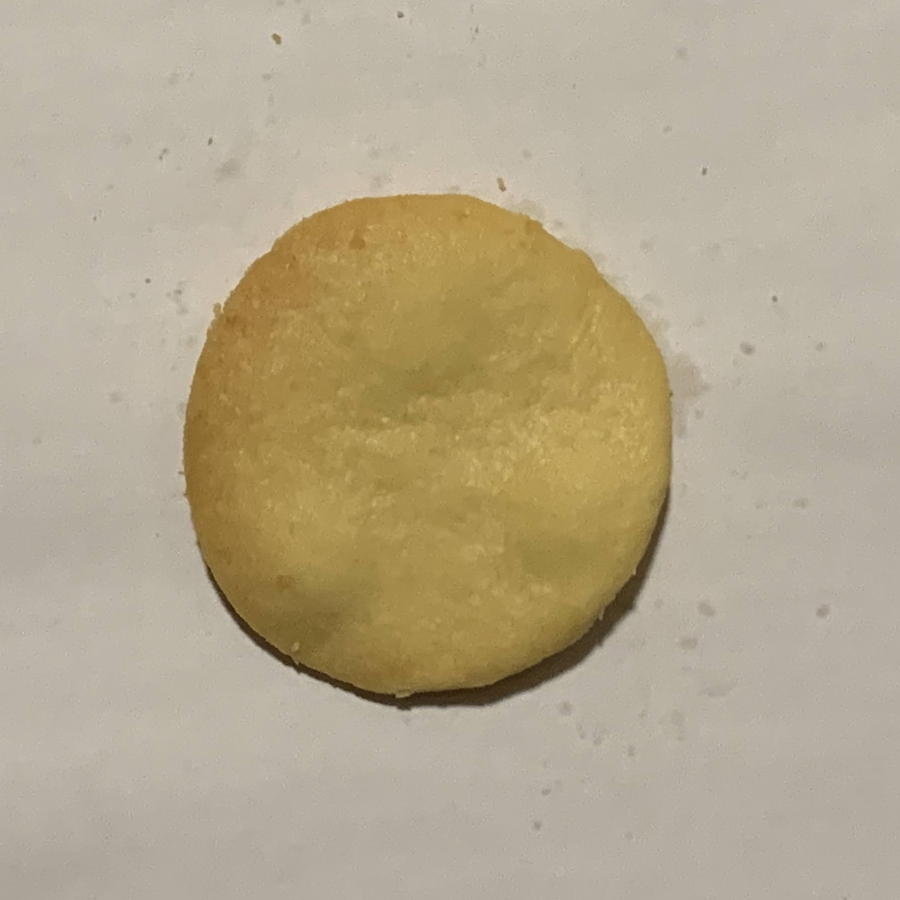
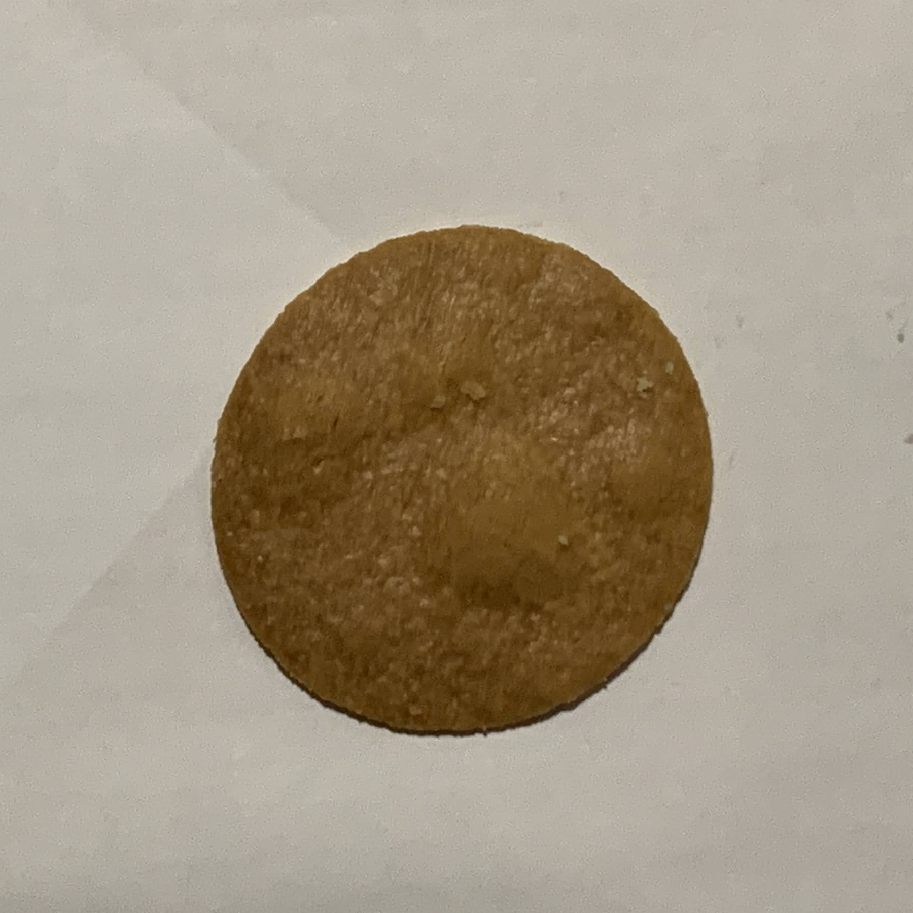
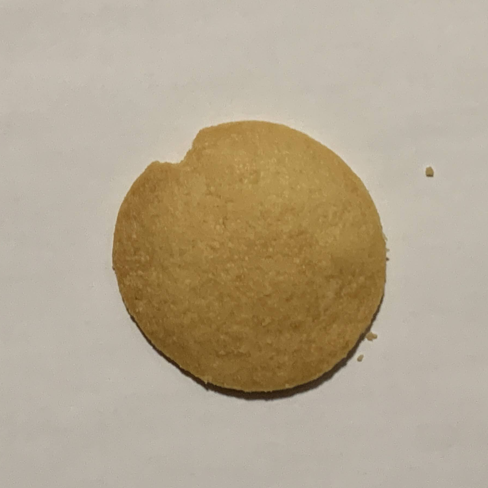

# Embedding を使った画像分類

## 概要

Amazon Titan Multimodal Embeddings G1 を使って Embedding を取得し、k-means でクラスタリングを行うスクリプト。
AWS ブログの[生成 AI で外観検査をやってみた](https://aws.amazon.com/jp/blogs/news/visual-inspection-with-generative-ai/)を参考に、書かれていないコードを追加している。

## データセットについて

自作のクッキー画像データセットを使用。

### クラス

#### good: 良品

#### burnt: 焦げ

#### chip: 欠け

